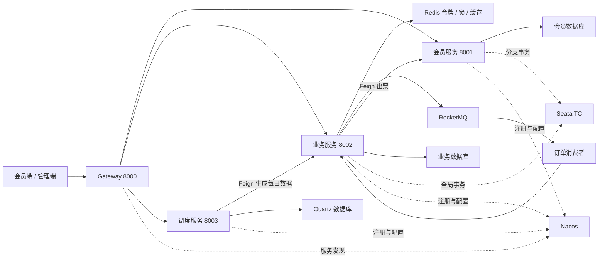

[README.md](https://github.com/user-attachments/files/33189186/README.md)
# 云程票务｜铁路售票微服务系统

围绕铁路售票场景实现会员与乘车人管理、车次维护、余票查询、多人选座、异步购票和每日车次生成。项目重点是座位区间复用、订单异步处理、并发控制与跨服务出票事务。

这是一个 Java 微服务开发实践项目，当前仓库为 `train-demo`。本文基于当前源码介绍实现与启动条件，不包含支付、退款和完整退改签流程，也不将现有代码视为生产级可靠性保证。

## 功能概览

| 场景 | 功能 |
| --- | --- |
| 会员端 | 手机号登录流程、乘车人管理、余票查询、购票、排队查询、取消排队订单与车票列表 |
| 管理端 | 车站、车次、途经站、车厢、座位及每日售票数据维护 |
| 库存与选座 | 使用座位 `sell` 字段表达各站区间占用，支持多人参考座位与相对偏移选座 |
| 异步购票 | 保存订单后发送 RocketMQ 通知，由消费者分批处理同日期与车次的订单 |
| 并发与治理 | Redis 令牌预检、Redisson 锁、Sentinel 资源保护 |
| 跨服务出票 | Seata 全局事务组织业务库存更新与会员车票写入 |
| 调度 | Quartz 任务管理，调用业务服务生成未来第 15 天数据 |
| 开发提效 | MyBatis Generator 与 FreeMarker 模板生成基础代码 |

## 技术栈

| 层次 | 技术 |
| --- | --- |
| 后端基础 | Java 17、Spring Boot 3.0.0、Maven 多模块 |
| 微服务 | Spring Cloud 2022.0.0、Spring Cloud Alibaba 2022.0.0.0 |
| 服务治理 | Nacos、Spring Cloud Gateway、OpenFeign、Sentinel |
| 数据与缓存 | MySQL、MyBatis、PageHelper、Spring Cache、Redis |
| 锁与消息 | Redisson 3.21.0、RocketMQ Spring Starter 2.3.6 |
| 分布式事务 | Seata |
| 调度与代码生成 | Quartz、MyBatis Generator、FreeMarker |
| 前端 | Vue 3、Vue Router、Vuex 4、Ant Design Vue、Axios、Vue CLI 5 |

业务模块显式使用 RocketMQ Client 5.5.0。Nacos、Seata、RocketMQ 的服务端版本需要与本地客户端依赖和配置配套验证。当前项目实际使用 MyBatis 与 Quartz。

## 模块与端口

| 模块 | 注册服务名 | 默认端口 / 上下文 | 职责 |
| --- | --- | --- | --- |
| `gateway` | `gatewayService` | 8000 | 统一路由、JWT 入口过滤与跨域配置 |
| `train-member` | `memberService` | 8001 / `/member` | 会员、乘车人和车票 |
| `business` | `businessService` | 8002 / `/business` | 车次、座位、余票、令牌与订单 |
| `batch` | `batchService` | 8003 / `/batch` | Quartz 任务管理与每日数据生成 |
| `common` | 不独立启动 | — | 返回结构、异常、会员上下文与 Feign 接口 |
| `generator` | 不独立启动 | — | MyBatis 与模板代码生成 |
| `web` | 前端 | 9000 | 会员购票页面 |
| `admin` | 前端 | 9001 | 基础数据与调度管理页面 |

网关按 `/member/**`、`/business/**`、`/batch/**` 路由，保留下游服务上下文路径。

## 架构与购票流程



### 订单受理与异步处理

1. `ConfirmOrderBeforeServiceImpl` 获取会员信息，进行日期与车次维度的令牌预检。
2. 创建 `INIT` 订单，保存乘车人和席别等购票信息。
3. 向 `CONFIRM_ORDER` topic 发送包含日期、车次的处理通知，返回订单 ID。
4. 消费者调用 `doConfirm`，获取日期与车次维度的 Redisson 锁。
5. 按 ID 升序，每批读取 10 条 `INIT` 订单，逐笔进入选座流程。
6. 订单先变为 `PENDING`，随后判断余票、选择座位并计算占用区间。
7. 独立的 `ConfirmOrderAfterServiceImpl.updateSeat` 通过全局事务组织座位更新、区间余票扣减、Feign 写入会员车票与订单成功状态更新。
8. 前端约每秒轮询一次排位，遇到终态停止轮询。

MQ 消息是“日期与车次有待处理订单”的通知，订单表保存实际待办内容。接口返回订单 ID 表示受理，不表示已经出票。

### 订单状态

| 状态 | 值 | 当前含义 |
| --- | --- | --- |
| `INIT` | `I` | 初始，等待消费 |
| `PENDING` | `P` | 处理中 |
| `SUCCESS` | `S` | 出票流程成功 |
| `EMPTY` | `E` | 无票；当前异常分类还需进一步细化 |
| `CANCEL` | `C` | 取消 |
| `FAILURE` | `F` | 枚举已定义，完整失败恢复流程待完善 |

取消入口、消费状态更新和异常处理存在独立边界，不能将该状态表理解为已经实现了完整的并发状态机。

### 区间库存与选座

对于 A、B、C、D、E 五个车站，一个座位用四个位置描述相邻区间：

```text
站点：     A —— B —— C —— D —— E
区间：       0     1     2     3
初始 sell：  0     0     0     0
售出 B→D：   0     1     1     0
```

占用区间为左闭右开 `[startIndex, endIndex)`。售出 B→D 后，同座位仍可售 A→B 或 D→E，但不能再售 A→C。

项目在 Java 中判断占用子串并通过位运算更新 `sell`；多人选座将参考座位转换为相对偏移，在同一车厢寻找满足区间可用条件的座位组合。售出后，还需扣减原本可使用该座位、现在受到影响的其他起终点区间余票。

这是数据库座位字段与 Java 运算的实现，未使用 Redis Bitmap。长站点序列、相邻区间边界和找不到完整多人座位组合等情况需要补充测试与保护。

## 目录结构

```text
train-demo/
├─ gateway/              # 网关服务
├─ train-member/         # 会员、乘车人、车票
├─ business/             # 售票业务
│  └─ src/main/
│     ├─ java/com/xzit/train/business/
│     │  ├─ controller/
│     │  ├─ service/impl/ # 令牌、订单受理、消费、选座和事务
│     │  └─ mapper/cust/  # 自定义区间扣票与令牌 Mapper
│     └─ resources/mapper/cust/
├─ batch/                # Quartz 与任务管理
├─ common/               # 公共结构、JWT、ThreadLocal 与 Feign
├─ generator/            # MyBatis Generator 与 FreeMarker
├─ web/                  # 会员端 Vue 工程
├─ admin/                # 管理端 Vue 工程
└─ pom.xml               # 聚合模块与依赖管理
```

## 本地启动

### 1. 准备基础设施

| 组件 | 用途与准备事项 |
| --- | --- |
| JDK 17、Maven 3.x | 后端编译运行，IDE 项目 SDK 与 Maven 使用同一 JDK |
| Node.js、npm | 两个 Vue CLI 前端；建议选择当前受支持的 Node LTS 并验证锁文件兼容性 |
| MySQL | 会员、业务与 Quartz 数据库，建议 8.x |
| Redis | 令牌、分布式锁和缓存，配置实际可访问地址与密码 |
| Nacos | 注册中心与配置中心，默认地址 `127.0.0.1:8848` |
| RocketMQ | 启动 NameServer 与 Broker，准备 `CONFIRM_ORDER` topic |
| Seata TC | 为跨服务出票提供事务协调，使用 Nacos 配置与注册 |
| Sentinel | 规则数据源与资源保护；默认控制台配置地址为 `localhost:18080` |

**当前仓库没有提供完整业务 DDL、Quartz 建表脚本、Seata `undo_log` 脚本或一键容器编排。** 在空环境启动前，需要补齐这些资源或使用已有开发数据库；仅创建空库无法完成购票演示。

### 2. 初始化数据库

当前连接配置对应：

| 数据库 | 服务 | 主要数据 |
| --- | --- | --- |
| `train` | `train-member` | `member`、`passenger`、`ticket` |
| `train_business` | `business` | 基础车次、每日座位/余票、`confirm_order`、`sk_token` |
| `train_batch` | `batch` | Quartz 的 `QRTZ_*` 调度表 |

准备步骤：

1. 创建三个数据库并导入匹配当前实体与 Mapper 的业务建表脚本。
2. 在参与 Seata AT 事务的业务库准备与实际 Seata 版本匹配的 `undo_log` 表。
3. 在 `train_batch` 导入与 Quartz 版本匹配的 MySQL 调度表脚本，核对表名前缀与大小写。
4. 为测试准备车站、车次、途经站、车厢和座位等基础数据。

`SchedulerConfig` 使用数据库 DataSource，调度表必须准备好。实体和 Mapper 可作为字段核对依据，但不能替代完整的 DDL、索引和约束定义。

### 3. 配置服务

各运行模块分别读取 `src/main/resources/application.yml` 与 `bootstrap.yml`。修改为自己的环境，或使用本地 profile、IDE 环境变量与对应 Nacos 配置覆盖；本地覆盖文件和凭据不要提交。

| 配置项 | 核对内容 |
| --- | --- |
| `spring.datasource.*` | 各服务自己的数据库地址、用户名与密码 |
| `spring.data.redis.*` | 当前样例存在开发机地址，应替换为本机或实际 Redis |
| `spring.cloud.nacos.discovery.*` | 注册中心地址、namespace；服务之间必须能相互发现 |
| `spring.cloud.nacos.config.*` | 配置中心地址、namespace、group、Data ID 与 properties 格式 |
| `rocketmq.name-server` | 使用 `host:port`，例如 `127.0.0.1:9876`；核对原配置中的 `http://` 前缀 |
| `seata.*` | 事务组、TC 注册位置、Nacos 配置与凭据 |
| `spring.cloud.sentinel.*` | 控制台、规则数据源与资源名 |

Nacos 当前注册与配置 namespace 值为 `train`。这里填写的是 **namespace ID**，不能仅创建同名显示名称而忽略其 ID。业务、会员与调度服务的默认 properties Data ID 通常分别为 `businessService.properties`、`memberService.properties`、`batchService.properties`；如使用 profile，也要核对对应 profile 配置。

Seata 当前约定：

- 事务组：`train-group`。
- TC 注册服务名：`seata-server`。
- Nacos group：`SEATA_GROUP`，namespace：`train`。
- 配置 Data ID：`seataServer.properties`。
- 配置中需要存在与 TC 集群一致的事务组映射，例如 `service.vgroupMapping.train-group=default`；`default` 必须与实际 TC 集群名一致。

Sentinel flow 规则的 Data ID 为 `sentinel`，group 为 `DEFAULT_GROUP`；当前该规则数据源未显式设置 namespace，需按其实际读取位置准备规则，不能直接假定与业务服务注册 namespace 相同。

网关配置中会员与业务路由当前使用了重复的 route ID。排查路由时，应将每条 route ID 配置为不同值并核对 `lb://` 服务名。

### 4. 编译并启动后端

先在项目根目录安装多模块产物：

```shell
mvn -DskipTests install
```

推荐在 IDEA 中分别启动以下入口：

| 模块 | 启动类 |
| --- | --- |
| `train-member` | `com.xzit.train.member.MemberApplication` |
| `business` | `com.xzit.train.business.BusinessApplication` |
| `batch` | `com.xzit.train.batch.BatchApplication` |
| `gateway` | `com.xzit.train.gateway.GatewayApplication` |

先启动 MySQL、Redis、Nacos、MQ 与 Seata，再启动会员、业务、调度及网关。使用本地 profile 时，在对应运行配置中设置，并确认 bootstrap/Nacos 没有覆盖成旧地址。

命令行方式可在四个独立终端分别执行：

```shell
mvn -pl train-member org.springframework.boot:spring-boot-maven-plugin:3.0.0:run
mvn -pl business org.springframework.boot:spring-boot-maven-plugin:3.0.0:run
mvn -pl batch org.springframework.boot:spring-boot-maven-plugin:3.0.0:run
mvn -pl gateway org.springframework.boot:spring-boot-maven-plugin:3.0.0:run
```

先执行根目录 `install` 是为了让各模块找到父 POM 和 `common`。命令显式指定与项目一致的 Spring Boot 插件版本；当前 gateway POM 未配置可执行包插件，不要直接假定其默认 JAR 可以 `java -jar` 启动。

### 5. 启动会员端与管理端

会员端，在一个终端执行：

```shell
cd web
npm ci
npm run serve-dev
```

管理端，在另一个终端执行：

```shell
cd admin
npm ci
npm run serve-dev
```

默认访问地址：

- 会员端：[http://localhost:9000](http://localhost:9000)。
- 管理端：[http://localhost:9001](http://localhost:9001)。
- 网关：[http://localhost:8000](http://localhost:8000)。

两个前端的 `.env.dev` 都通过 `VUE_APP_SERVER=http://localhost:8000` 访问网关。更换网关地址后需重启开发服务。

### 6. 准备每日售票数据

先通过管理端维护基础数据，建议按以下顺序操作：

```text
车站 → 车次 → 途经站与站序 → 车厢 → 座位
     → 指定日期每日车次 → 每日站点/车厢/座位/余票/令牌
```

生成指定日期的接口为：

```text
GET /business/admin/daily-train/gen-daily/{yyyy-MM-dd}
```

该流程会删除并重建对应日期与车次的数据。演示时使用无既有售票记录的测试日期，不应对已开售且已有订单的日期重复生成。

### 7. 配置每日任务

管理端 `/batch` 页面或 `/batch/admin/job/add` 接口可注册任务。请求示例：

```json
{
  "name": "com.xzit.train.batch.job.DailyTrainJob",
  "group": "train",
  "description": "生成未来第15天的每日售票数据",
  "cronExpression": "0 0 1 * * ?"
}
```

示例表达式按调度器时区每天 01:00 执行。`name` 必须是任务类全限定名。首次需要注册任务，启动 batch 服务本身不代表该任务已创建。任务每次只计算“当前日期 +15 天”的那一天，并通过 Feign 调用 business。

## 主要接口

以下为通过网关调用时的完整路径。会员端获取 token 后，后续调用按前端实现放入 `token` 请求头；接口参数以 Controller、Req 和前端请求代码为准。

| 方法 | 路径 | 用途 |
| --- | --- | --- |
| POST | `/member/send-code` | 验证码流程 |
| POST | `/member/login` | 登录并获取会员 token |
| GET | `/business/daily-train-ticket/query-list` | 查询余票 |
| POST | `/business/admin/confirm-order/do-confirm` | 提交订单，返回订单 ID |
| GET | `/business/admin/confirm-order/query-rank/{id}` | 排位与处理结果 |
| POST | `/business/admin/confirm-order/cancel-order/{id}` | 取消排队订单 |
| GET | `/business/admin/daily-train/gen-daily/{date}` | 生成测试日期数据 |
| POST | `/batch/admin/job/add` | 注册 Quartz 任务 |
| POST | `/batch/admin/job/run` | 手动触发已注册任务 |
| GET | `/batch/admin/job/query` | 查看任务 |

路径中的 `admin` 是当前代码组织方式，不代表接口已经完成管理角色与资源归属校验。

## 联调与排查

建议先用一个车次、少量座位和五个站点验证：

1. 基础数据与每日售票数据齐全，会员可以查询并添加乘车人。
2. 提交订单后先获得订单 ID，再观察 MQ 日志与状态变化。
3. 检查会员车票、座位 `sell` 和各区间余票是否同步变化。
4. 验证不相交区间能复用同一座位，相交区间不能重复售卖。
5. 对多人选座、重复消息、远程服务失败、取消竞争和处理中重启进行故障验证。

| 现象 | 优先检查 |
| --- | --- |
| 服务注册成功但网关报 503 | namespace ID、服务名、路由 ID、Nacos 中实例健康状态 |
| MySQL 表不存在 | 业务 DDL、Quartz `QRTZ_*`、Seata `undo_log` 是否初始化 |
| MQ 连接或消费失败 | NameServer 格式、Broker 可达地址、topic、consumer group |
| 订单停在 INIT | 消息是否投递、消费者日志、锁竞争与待办扫描 |
| 订单停在 PENDING | 选座结果、远程出票、事务日志及处理中订单恢复 |
| Seata 事务未生效 | 数据源代理、XID 传播、TC 事务组映射与异常是否传回 |
| 查询没有余票 | 查询日期是否已生成数据、站序与区间数据是否匹配 |
| 定时任务不执行 | 任务是否注册、Quartz 表、cron 与时区、Feign 调用结果 |

前端生产构建在各自目录执行 `npm run build`。后端 `mvn test` 需要配套测试环境；当前仓库未提供完整购票链路的自动化回归或性能基准。

## 当前开发状态与后续方向

- 令牌预检用于控制进入购票流程的请求，并非按席别、区间和乘车人数建模的精确库存。
- 普通消息发送与订单落库的一致性、提交与出票幂等、`PENDING` 超时恢复需要完善。
- Redisson 锁串行化主消费流程；库存更新条件、多人选座完整性及区间边界仍需强化验证。
- Seata 注解表达跨服务事务边界，实际回滚还依赖 XID、数据源、响应检查与异常传播；失败返回不能直接当成出票成功。
- 取消状态竞争、应用权限、会员 ThreadLocal 清理、Sentinel blockHandler 签名及多实例 Snowflake 节点编号是后续修正项。
- 定时重建需增加开售状态保护，避免覆盖已有售票数据。

